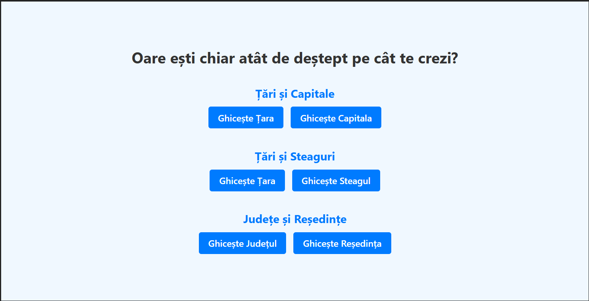
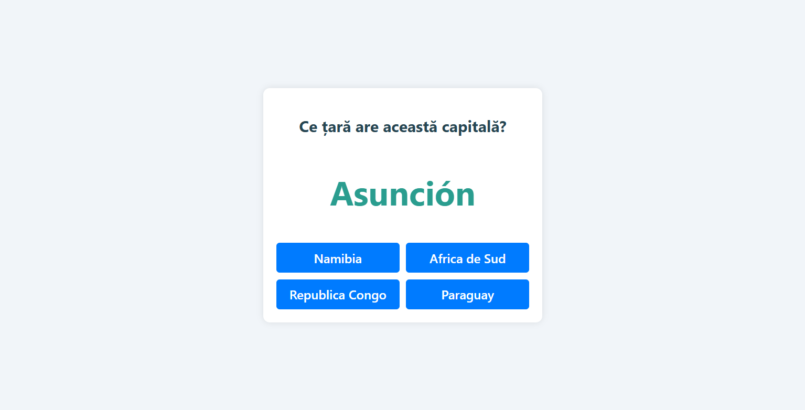
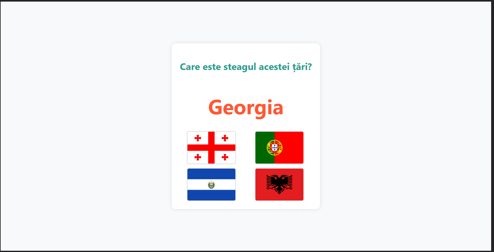
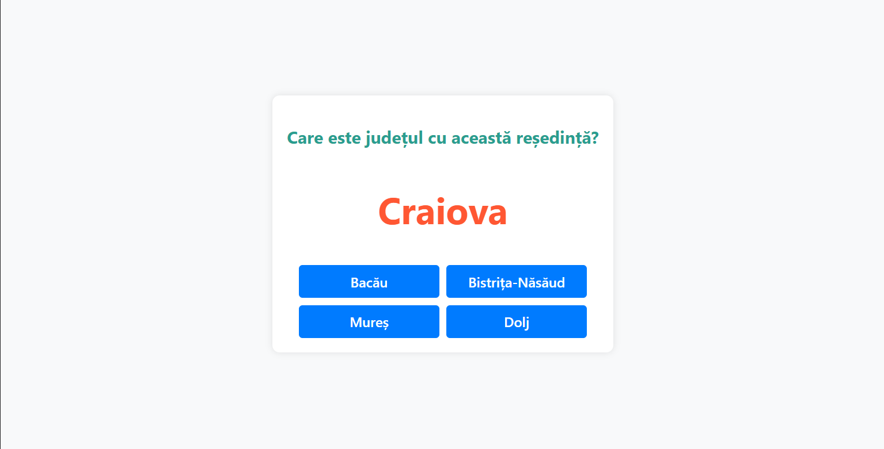

# 🇷🇴 GeoGame - Test Your World Knowledge

GeoGame este o aplicație educațională interactivă de tip Quiz, născută din pasiunea mea personală pentru geografie.

Proiectul a fost dezvoltat pentru a oferi o modalitate modernă și rapidă de a testa și consolida cunoștințele despre harta politică a lumii. Spre deosebire de alte quiz-uri simple, această aplicație acoperă **întreaga bază de date globală** (toate cele 195+ țări recunoscute), nu doar cele mai cunoscute.



## Moduri de Joc

Aplicația este structurată pe trei categorii principale de dificultate:

### 1. Țări și Capitale
Testează legăturile politice dintre națiuni și centrele lor administrative.
* **Ghicește Țara:** Se dă capitala, trebuie aleasă țara.
* **Ghicește Capitala:** Se dă țara, trebuie aleasă capitala corectă.

### 2. Țări și Steaguri 
Un mod vizual care testează recunoașterea simbolurilor naționale.
* Include steagurile tuturor țărilor, redate la rezoluție înaltă.

### 3. Modul Special: România 
Dedicat geografiei locale, acest modul testează cunoștințele despre organizarea administrativă a României.
* **Județe și Reședințe:** Corelarea celor 41 de județe cu orașele lor de reședință.

## Tehnologii Utilizate

* **React 18:** Pentru o interfață rapidă și modulară (Componente reutilizabile pentru butoane și carduri).
* **TypeScript:** Pentru gestionarea strictă a tipurilor de date (Interfețe pentru obiectele de tip `Country`, `County`).
* **Vite:** Pentru un mediu de dezvoltare ultra-rapid.
* **CSS Modules:** Design responsive și curat.

## Instalare și Rulare

1.  Clonează proiectul:
    ```bash
    git clone [https://github.com/rebecabaciu/geo-game.git](https://github.com/rebecabaciu/geo-game.git)
    cd geo-game
    ```

2.  Instalează dependențele:
    ```bash
    npm install
    ```

3.  Pornește aplicația:
    ```bash
    npm run dev
    ```




